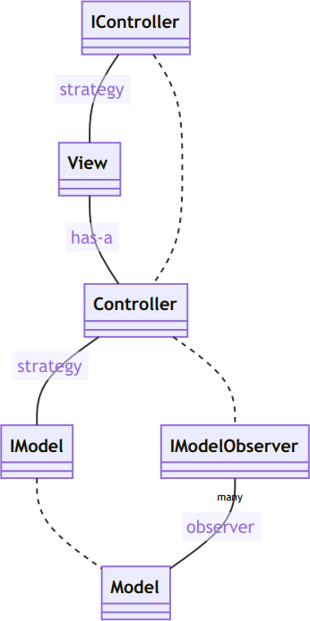
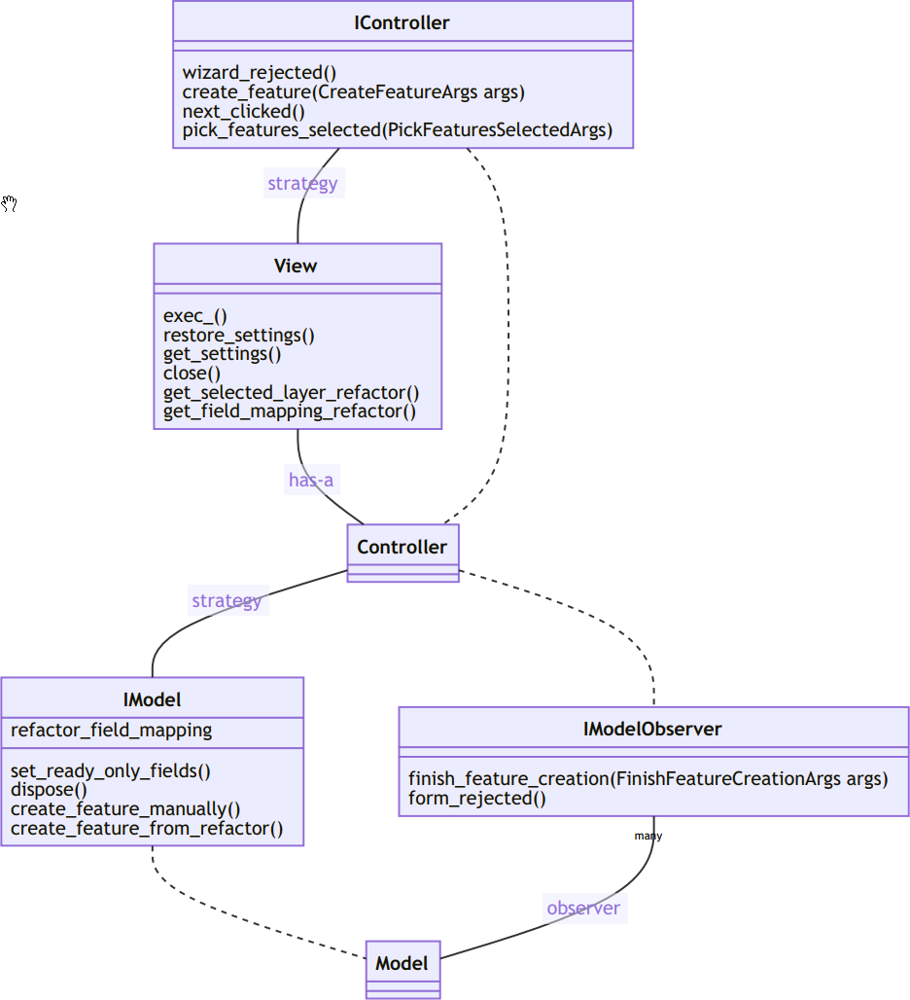
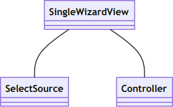
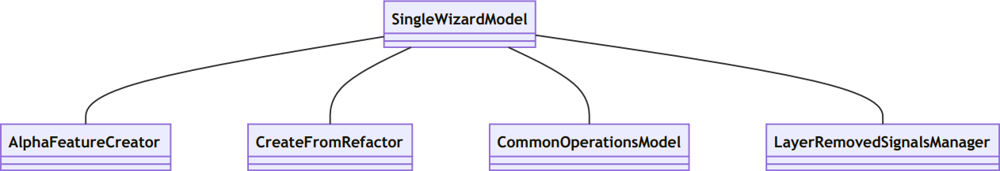

# MVC



## Un ejemplo: SingleWizard



En SingleWizard, al controlador se le pasa el modelo como *strategy* desde el constructor. A su vez, el controlador es un *observer* del modelo a través de las señales que proporciona este último:

```python
class SingleWizardController(QObject, metaclass=AbstractQObjectMeta):
    # ...

    def __init__(self, model: SingleWizardModel, db, wizard_settings):
        # ...
        self.__model = model
        self.__model.finish_feature_creation.connect(self.finish_feature_creation)
        self.__model.form_rejected.connect(self.form_rejected)
        self.__model.layer_removed.connect(self.layer_removed)
        # ...
```

El controlador tiene una vista *(has-a)*, en donde se le pasa una referencia de sí mismo en el constructor de la vista como *strategy*.

```python
class SingleWizardController(QObject, metaclass=AbstractQObjectMeta):
    # ...

    def __init__(self, model: SingleWizardModel, db, wizard_settings):
        # ...
        self.__view = self._create_view()

    def _create_view(self):
        # el controlador es el primer parámetro del constructor de la vista
        return SingleWizardView(self, self._get_view_config())
```

```python
class SingleWizardView:
    def __init__(self, controller, view_config):
        # ...
        self.__controller = controller
```

**Objetos de la vista**



**Objetos del modelo**



### A tener en cuenta

Escoger qué es Model y qué es vista es un poco difuso:

- Todo lo de geometría se consideró lógica de negocio (aunque se ve)
- La creación por refactor es **model**, pero termina llamando a un formulario (el del refactor)
- La creación **manual** es **model** pero abre el formulario del feature

### Strategy, has-a

#### Strategy:

```python
class SingleWizardView:
    def __init__(self, controller, view_config):
        self.__wizard = QWizard()
        self.__controller = controller    #  No crea la instancia. Es intercambiable
        # ...
```

#### Has-a (No strategy):

El objeto de la clase **CreateFromRefactor** es creado dentro de la clase. No se puede cambiar fácilmente con otra implementación

```python
class CreatorModel(ABC):

    def __init__(self, iface, db, wiz_config):
        # ...
        self.__feature_creator_from_refactor = CreateFromRefactor(self.app, db)
```
